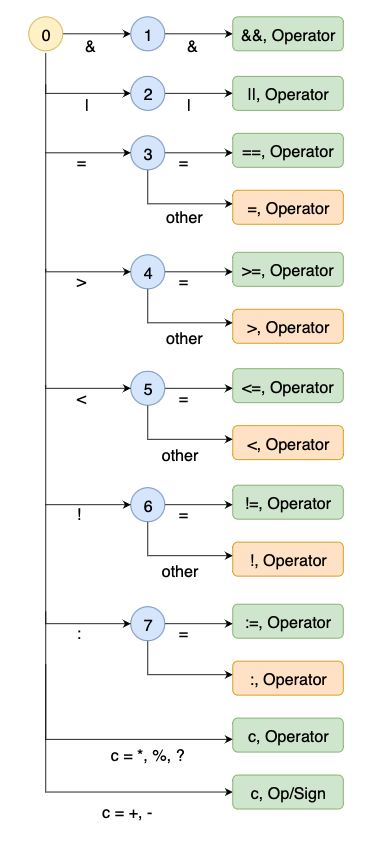
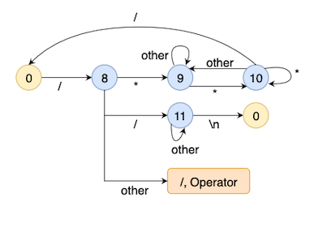
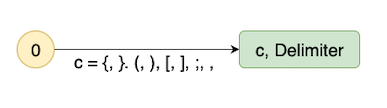
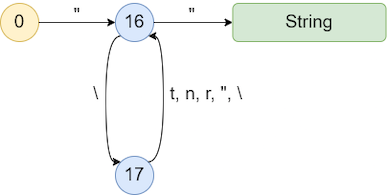

# CODEX
CODEX is a C++ like programming language consisting of a lexer, parser and intermediate code generator.

It is our submission for the Compiler Construction group assignment.
The group members include:
1. Aryan Chaubal (2019A7PS0130H)
2. Samarth Kumar Manish Kumar Jain (2019A7PS0179H)
3. Prathamesh Jadhav (2019A7PS0084H)

## Running
Create an executable by running:
```
make -f parser.mk
```
This will create an executable `parser`, run it:
```
./parser <input file>
```
To run the lexer:
```
make -f lexer.mk
```
This will create an executable `lexer`, run it:
```
./lexer <input file>
```
### Running the testcases
Several testcases have been provided in the `testcases/input` directory. You can run them all at once by running the `run_testcases.sh` script.
1. Add your testcases to the `testcases/input` directory.
2. Give permission to run the shell script:
```
chmod +x run_testcases.sh
```
3. Run all testcases:
```
./run_testcases.sh
```

The output for these testcases will be stored in the `testcases/output` directory.

## DFA
The lexer is implemented using a deterministic finite automata.
The following notations are used to show the states and operations to be performed:
- **Yellow Circle**: Used to indicate the initial state; this is the state 0.
- **Blue Circle**: Used to indicate any state of the finite automata except the initial state.
- **Green Box**: This is used to indicate successful scanning of a symbol token. The token is added to the tokens list and symbol table, the state is reset to 0 and the next symbol is ready to be scanned. 
- **Orange Box**: This is used to indicate successful scanning of a symbol token. The token is added to the tokens list and symbol table, the state is reset to 0. However, in this case, the same character will be read again (character pointer does not get incremented).

The DFA has been divided for different token types to simplify the diagrams.

### Operators

### Comments

### Delimiters

### Integers and Floating Point numbers

### Strings


Please note that in case some transitions are not added, they will automatically go to the error state.

## Grammar and SDD
You can view the grammar and SDD in `grammar.txt` and `sdd.txt` respectively.

The method to generate the three address code was obtained from [here](http://seclab.cs.sunysb.edu/sekar/cse304/codegen.pdf).
